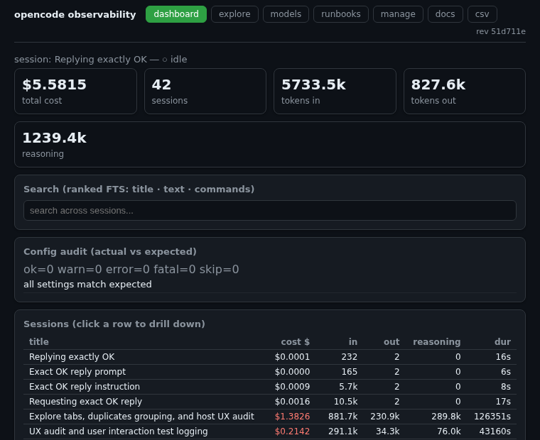
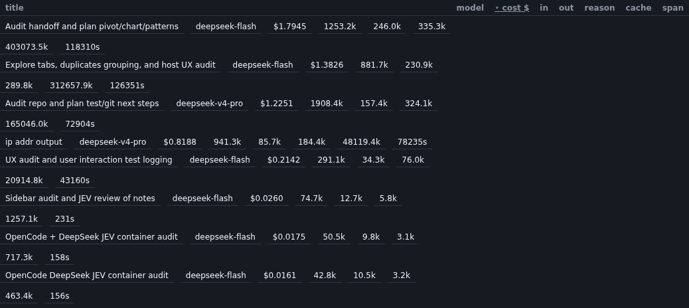
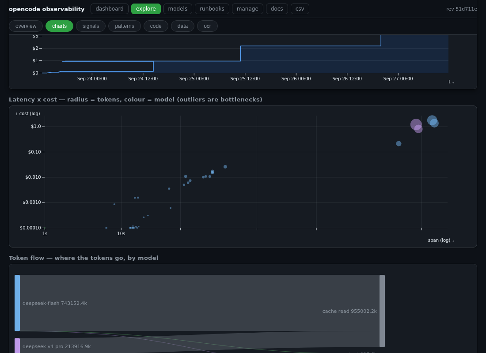
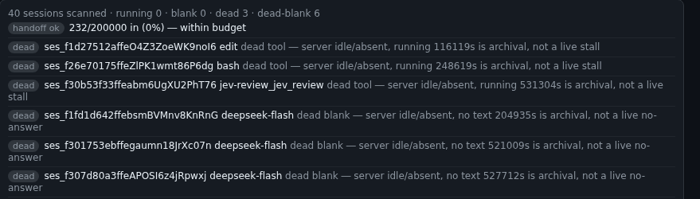
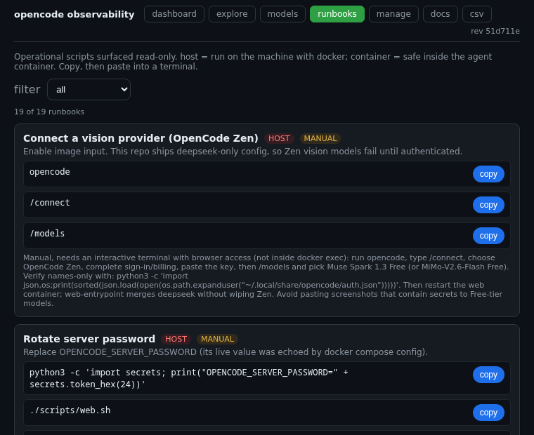
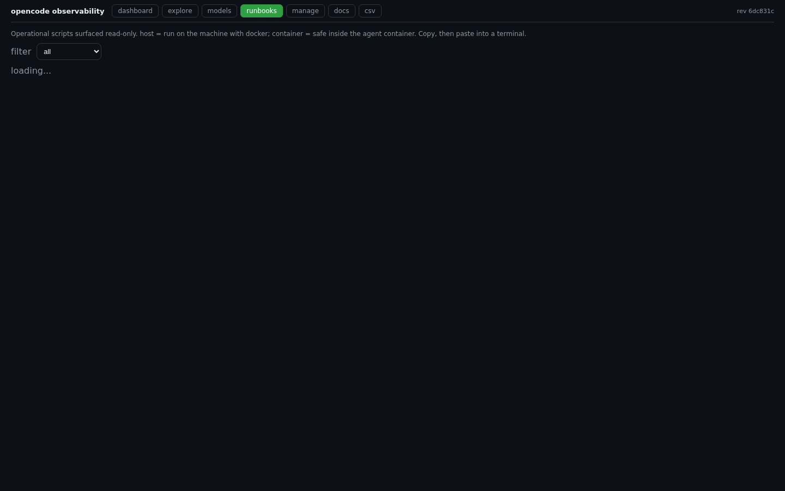
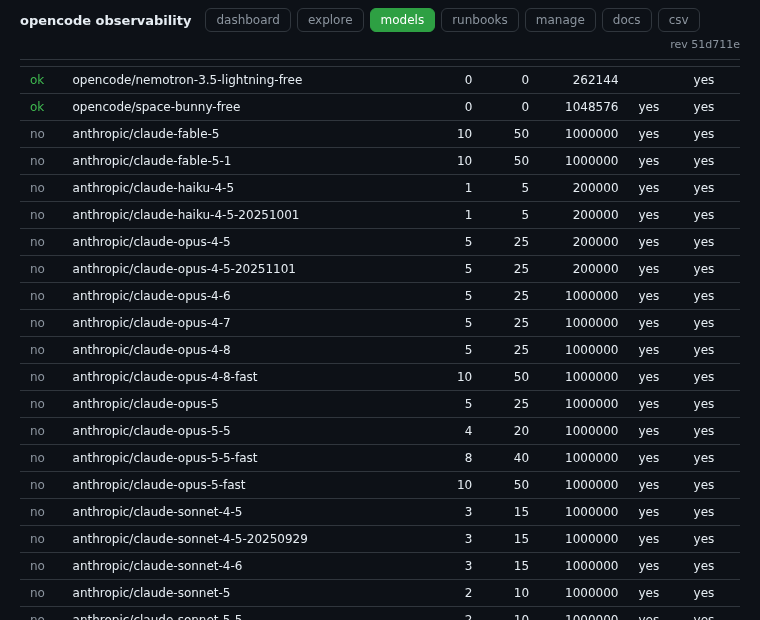

# OpenCode + DeepSeek V4.1 Flash + Jev

Docker-based setup. All project code stays inside this repository.

## Prerequisites
- Docker Engine (daemon reachable by current user)
- gh (GitHub CLI), authenticated
- DeepSeek API key (prefix sk-)
  https://platform.deepseek.com/api_keys
- Jev API key (prefix apikey_)
  https://console.typesafe.ai/keys

## Quick Start
cd docker
./build.sh
./run.sh

Keys are cached in ../.env.local (mode 0600, gitignored).

## Vision / image input
DeepSeek V4.1 Flash natively ingests images. `opencode.json` declares this
(`attachment: true` + `modalities.input: ["text","image"]`), so OpenCode
sends screenshots to DeepSeek directly — no separate provider needed.
(OpenCode gates image input on the model's declared `modalities`; a custom
provider entry without that declaration is treated as text-only.)

If a model rejects an image anyway, read it locally instead:

    ./scripts/ocr-image.sh <image.png>      # tesseract CLI, tesseract.js, or PaddleOCR
    ./scripts/ocr-image.sh --check          # report which engine is available

Each run is persisted to data/observability/ocr_run and surfaced in the
dashboard: /api/ocr lists runs, /api/export/ocr downloads CSV, and the OCR
text is folded into /api/semantic so the search box finds screenshots too.

The engines match github.com/swipswaps/receipts-ocr: tesseract.js (browser)
and PaddleOCR (backend/app.py). **tesseract.js + pngjs are pinned in
package.json** and installed via `npm install`, so it reads screenshots out
of the box with no apt/pip and no API model; oversized images are
downscaled before OCR so very tall screenshots don't stall. `tesseract-ocr`
is also baked into the image. PaddleOCR is available with
`pip install paddleocr paddlepaddle`.

## Linting
    ./scripts/lint.sh

Static gate over the repo: `bash -n` on every script, `shellcheck` (baked
into the image), `node --check` on the JS (including
`.opencode/plugins/*.js`), `py_compile` on the Python, a `subprocess.run`
check, a `scan-constraints.py` pass (code vs string/comment) over
`scripts/*.sh`, and a RULES grep (no `sed`, no `2>/dev/null`).

Every check line carries `ms=<wall time since the previous check>` and the
slowest check is named at the end — the actionable signal that a bare timeout
is not. `shellcheck` runs in parallel (one background job per file); serially
it was ~40s and was what pushed the combined gate past its budget.
`test-dashboard.sh` already runs `lint.sh` and `test-hygiene.sh`, so run it
alone rather than chaining all three (chaining doubles the lint cost).

If tool output looks empty, suspect suppressed streams: the blacklist guard
exists so `2>/dev/null` cannot hide the diagnostic. Audit with
`./scripts/audit-tool-calls.py` — it reports exactly which commands hid stderr.

## Blacklist enforcement (three layers)
The blacklist (`sed`, `2>/dev/null`, `subprocess.run`, `rm -rf`, `echo`) is
enforced at three points: files (`lint.sh` + `scan-constraints.py` fail the
build), runtime detection (`scripts/audit-tool-calls.py` reports what the agent
ran), and runtime prevention (`.opencode/plugins/blacklist-guard.js`, auto-loaded
from the plugin dir — no `opencode.json` entry, which would double-load it).
The guard hooks `tool.execute.before` and acts on the agent's own bash commands
during "Thinking" before they run: **block** (`sed`/`rm -rf`/`subprocess.run`,
throws with the substitute), **fix** (`2>/dev/null` — the redirect is removed so
stderr, the proof, reaches the result), **warn** (`echo`). Matching is
quote-aware (`grep 'sed'` passes). Policy: `OPENCODE_BLACKLIST_GUARD` =
unset/`block` | `warn` | `off`; reload with
`docker compose -f docker/docker-compose.yml restart opencode-web`. Full detail:
HANDOFF "Hygiene enforcement"; unit test: `blacklist-guard-self-test.mjs`.

## Writing prompts
A prompt is an interface contract: state the falsifiable outcome, the
constraints, and the evidence. This keeps the work checkable without
re-reading the whole chat — which is also what keeps context (and cost)
down. Template:

    ## Objective
    <one sentence: the falsifiable outcome>
    ## Context (read first)
    HANDOFF.md, RULES.md, README.md; <specific files / endpoints>
    ## Constraints (non-negotiable)
    RULES.md; blacklist enforced by .opencode/plugins/blacklist-guard.js;
    read-only over data/opencode/opencode.db.
    ## Deliverable
    <exact artifacts>
    ## Acceptance criteria (each independently checkable)
    - [ ] `<command>` prints `<expected>`
    - [ ] `./scripts/<gate>.sh` exits 0
    ## Evidence (paste back)
    gate outputs, `git diff --stat`, exact commands.
    ## Out of scope
    <what not to touch>

`./scripts/prompt-lint.py --prompt "..."` classifies a prompt, fuzzy-matches
it against past prompts, surfaces recurring errors, and flags blacklist
mentions / secrets / vagueness / missing acceptance criteria. Use it before
sending a large request.

To use a *different* vision model (e.g. Muse Spark via OpenCode Zen), on a
host terminal with browser access run `opencode`, `/connect` → OpenCode Zen,
`/models`. Avoid pasting secret-bearing screenshots to Free-tier models.

## Telemetry policy
Smoke tests stream stdout and stderr live via process substitution
(> >(tee file)). No buffering. The user sees the model's response
as it arrives. The safety timeout (120s) fires only if the process
genuinely makes no progress.

## Smoke test methodology
opencode 1.18.31 exits non-zero after a successful non-TTY response.
The staging script asserts on response text ("OK") instead of exit
code. Elapsed time and exit code are reported for diagnostic purposes
but do not determine pass/fail.

## UID handling
Container runs with --user $(id -u):$(id -g). /home/node is chmod 777
at build time.

## Secrets hygiene
- Keys never appear on docker CLI argv (bare -e VAR).
- curl Authorization headers written to mode-0600 temp files.
- .env.local is gitignored and mode 0600.
- The web UI (port 4096) requires OPENCODE_SERVER_PASSWORD; web.sh
  refuses to start without it (pass --insecure to override).
- Port 4096 is bound to 127.0.0.1 only (loopback). The password is the single
  gate, so it must not be the only thing between the service and a LAN.
  Widening it is a three-part change — rotate first, widen only the publish
  line, then firewall the CIDR; see HANDOFF "Exposing 4096 to the LAN". Never
  widen the port alone.
- data/opencode/ and data/observability/ are gitignored, so session text and
  telemetry are never pushed. Session EXPORTS (/api/export/session, the sessions
  CSV) are **redacted** at the boundary by `scripts/redact.mjs` (key shapes and
  `NAME=value` assignments), so a leaked value in the transcript does not leave
  the system; `node scripts/redact.mjs` also filters stdin.
- Stale *.bak.* snapshots (including old .env.local.bak.* key copies)
  are removed with ./scripts/cleanup-baks.sh --apply.

## Logs
Full staging output captured to ../staging.log.

## Verification (V1 command surface)
opencode V1 has no "mcp list" subcommand. MCP servers are read from
opencode.json. The staging script verifies:
- opencode --help loads the binary
- opencode.json parses and lists mcp.servers keys via python3
- the image builds
- DeepSeek smoke test returns response text "OK"
- plugin list returns output (exit code informational)

## Cost monitoring
    ./scripts/cost.sh
    ./scripts/cost-bottlenecks.sh --top N

Prints DeepSeek cost accounting from two sources: the opencode database
(per-session USD cost and input/output/reasoning/cache tokens) and the
provider balance endpoint (https://api.deepseek.com/user/balance). The
API key is read from .env.local and never printed. Note that jev-review
MCP calls are billed separately by TypeSafe and do not appear in the
DeepSeek balance.

Model choice is the dominant cost lever. Keep the agent on `deepseek-flash`
(the opencode.json default) or a free model: a non-flash reasoning model
(e.g. `deepseek-v4-pro`) re-prices the whole context every turn — 2.9x the
input price. Three long "audit" sessions on v4-pro were ~94% of lifetime
spend at their peak; the live share drifts, so read it from
`cost-bottlenecks.sh` "model mix check" (or the /models page), not from a
hard-coded number. The ceiling is `models.policy.json`.

## Live activity ("thinking")
    ./scripts/thinking.sh            (terminal)
    ./scripts/dashboard.sh           (web: http://127.0.0.1:5099)

thinking.sh tails the opencode database and prints what the agent is doing
in real time: step boundaries, tool calls (with running/completed/error
state and the command), reasoning text, and answer text. dashboard.sh is
the same data in a read-only browser view, with cost cards and the todo
list. Both poll the database (2s) and run in the container and on the
host. Predictive cost: ./scripts/cost.sh --estimate IN OUT [REASONING].

The dashboard drills down. Click a session row to see its detail panel
(cost, tokens, span, message count) and the ordered tool/reasoning/text
parts. Each detail panel offers a per-session chat-history download as
txt, md, or json (/api/export/session). The search box runs ranked
full-text search across every session — text, reasoning, and tool
commands — via an in-memory SQLite FTS5/bm25 index (/api/semantic).
http://127.0.0.1:5099/runbooks lists the operational runbooks (host vs
container) with copy buttons; ./scripts/runbook.sh runs them as a menu.
scripts/runbooks.json is the single source for both — add entries there, not
in dashboard.mjs. Entries include the blacklist guard (pause/resume), balance
top-up, and the log miner below. Note the dashboard on :5099 runs inside the
opencode-web container (web-entrypoint.sh starts it), so restarting that
container takes :5099 down for a few seconds.

## Learning from the logs
    ./scripts/issue-solutions.py [--top N]        # issues -> proven fixes
    ./scripts/logs.sh [--source S] [--since MIN]  # raw telemetry

Free, local, no model call. `issue-solutions.py` reads the chat database
read-only and pairs each error tool call with the next completed call in the
same session, then ranks the recurring (issue, fix) pairs with the log
evidence. Example output: "JEV_API_KEY rejected" x8 -> the env/`.env.local`
checks that fixed it; "Could not find oldString" x4 -> the grep that located
the real text. Run it with `--write` to persist
data/observability/solutions.json, served at /api/solutions and shown as
"known fixes" on /explore ▸ patterns.

`logs.sh` is the raw layer behind that: `--source guard` (every blacklist
block/fix/warn the agent's own "Thinking" triggered, from
data/observability/guard.log), `error` (tool failures + stack trace),
`event` (the opencode event bus), `app` (~/.local/share/opencode/log/
opencode.log), `system` (docker logs; host only), `packet` (the exact
tcpdump command). Use it when a step is slow or output looks empty — the
`ms=` telemetry names the slow check; `logs.sh` shows why.

## Repo code index
    ./scripts/code-index.py            # assemble + flag the repo's own code
    ./scripts/code-index.py --flags    # file:line flag list
    ./scripts/code-index.py --grep RE  # files whose path/symbols match

Indexes the repo's own code/config/docs (per-file metadata + top-level symbols)
into data/observability/code.db and flags blacklist patterns plus TODO/FIXME —
so code can be inspected alongside the chat database and, later, classified by
Jev/Laya/DeepSeek. Surfaced at /api/code and /explore ▸ code.

## Duplicate prompts (dedup / semantic cache)
`prompt-lint.py` flags a prompt that is >= 0.9 similar to a prior user prompt
(token Jaccard): reuse the prior answer instead of spending another session.
That is the local, deterministic form of a semantic cache.

`learn-rules.py` goes a step further: it builds **(state, action, outcome)**
triples from the log — the error signature, the shape of the next call, and
whether it completed — and emits advisory *avoid* / *prefer* / *recovery*
rules to data/observability/learned-rules.json. Run it with `--since-days` so
a stale pattern expires. The guard reads the rules and records `learned`
advisories; nothing is blocked until a confirmed pattern is promoted into
RULES.md / the guard's fixed blacklist. Learn → review → codify → enforce.

`TODO.md` is the running backlog: HANDOFF.md is the durable state, TODO.md is
the queue. Update both at the end of a session.

## Navigating the observability UI
Every page (/ dashboard, /explore, /runbooks, /docs) shares one sticky nav:
`dashboard · explore · models · runbooks · manage · docs · csv`. The /explore tabs
(overview · charts · signals · ocr) are linkable and restore from the URL
hash, so `http://127.0.0.1:5099/explore#charts` opens the charts tab and the
browser back/forward buttons work. /docs renders this repo's own HANDOFF.md,
RULES.md, README.md, scripts/README.txt and HANDOFF-PROMPT.txt in-UI
(read-only, whitelisted names via /api/doc), so the rules are reachable
without leaving the browser. /manage (API /api/tools, source scripts/tools.json)
surfaces the repo's tools — purpose, host/container, copyable commands — so the
scripts are discoverable from the UI, not only the terminal. The nav shows the
**served git revision**; if the on-disk HEAD differs it turns red
(`STALE served … vs HEAD …`) — restart opencode-web to serve new code. Data
exports: `/api/export` (sessions CSV), `/api/export/session`, `/api/export/ocr`,
`/api/export/patterns`, `/api/export/guard`. The **signals** tab also carries a
**session-health** panel (`/api/health`) that flags stalled/blank turns from the
database alone — the route-around when the interactive web view freezes.
Async panels never render blank: each carries a `loading...` skeleton that
is replaced on render (`data-error` on failure), and the signals pane
re-renders on every tab activation so live adjudication converges without
a reload. Proof screenshots (all captured with Playwright against a
scratch dashboard build, none retouched):

- docs/ux/signals-adjudicated.png — /explore ▸ signals showing
  `running 0 · blank 0 · dead 3 · dead-blank 6` (live-adjudicated;
  scratch :5225 serving this HEAD).
- docs/ux/loading-runbooks.png — /runbooks mid-fetch with the
  `loading...` skeleton visible (Playwright route-delayed /api/runbooks
  by 4 s; asserted `list == "loading..."` before capture).
- docs/ux/explore-sessions.png — /explore overview sessions table
  (42 sessions, same scratch build).

## Usage guide (step by step, with screenshots)

Video walkthrough (22 s, 11 captioned steps, captured live against the
served build with scripted Playwright): `docs/ux/usage-tour.mp4`.

All shots captured with Playwright against a scratch dashboard build;
see `docs/ux/` for the files. The served revision banner (top right)
tells you whether you are looking at current code.

### 1. Dashboard — costs, sessions, live activity

Open `http://127.0.0.1:5099/`. The stat cards show total cost, session
count and token use; the sessions table (click a row) drills into one
session; live activity streams tool calls as they happen.

### 2. Explore — overview, charts, signals

`/explore` has seven tabs. The overview table sorts/filters all
sessions by cost and tokens:

The charts tab carries cumulative spend (drag to brush-filter every
view below it), latency-x-cost scatter, token flow, sessions-over-time
and the word cloud:

The signals tab adjudicates stalls against the live server — dead
findings are archival, not live stalls:

### 3. Runbooks — filter, read, copy

`/runbooks` lists the 19 operational runbooks with host/container
tags. Filter by tag, read the steps inline, copy commands with the
copy button. Async panels show a `loading...` skeleton while fetching,
never a blank shell:

### 4. Models — catalog and policy

`/models` shows the model catalog, the cost policy verdict
(ALLOW/ASK/BLOCK) and per-model tool-error ledgers:

## Session health (stalls / blank turns)
The interactive web view can freeze ("Shell" stuck, blank message pane) while
the agent is not actually stalled; the server's store is still complete.
`scripts/session-health.mjs` reads data/opencode/opencode.db read-only and
reports two low-false-positive signals straight from the row log:

- running_tool — a tool part still state.status="running" past --run-ms
  (default 120s): the sharpest agent-stall fingerprint.
- blank_tail — a recent session whose last part is a tool with no text part
  after it: the "no answer printed" fingerprint.

It deliberately does NOT report long inter-part gaps: measured here they were
~100% overnight user-idle, and a noisy alert is worse than none ("cry wolf").
Served at /api/health and /explore ▸ signals; --live additionally reads
GET /session/status; --self-test runs offline on synthetic fixtures and is
gated in test-hygiene.sh. No model call, no browser.

The UI follows DESIGN.md: one accent (#2ea043), an 8px grid, Material
elevation on cards (rest on --e1, rise to --e2 on hover), 8px radius on
surfaces and 999px pills. The tokens + overrides live in `THEME_CSS` in
scripts/dashboard.mjs and are injected on every page.

## One command for the whole state
    ./scripts/harness.sh [--fast] [--export]

Runs every gate (lint, test-hygiene, test-patterns, test-dashboard), then the
live telemetry (guard actions + tool errors), the cost headline, the learned
rules, the model catalog, the doc budget and the TODO "in flight" list, and
prints a summary. `--fast` skips the slow dashboard gate; `--export` writes a
timestamped report to logs/; `--json` emits only
`{ts,rev,passed,failed,gates[]}` for a wrapper. Robust: a failing gate is
reported and the run continues.

The tooling's machine interfaces are contract-tested:

    ./scripts/test-tooling.sh     # every --json tool emits the keys callers read
    ./scripts/test-hygiene.sh     # runs test-tooling.sh too

test-tooling.sh proves preflight, doc-budget, learn-rules, issue-solutions,
audit-tool-calls, prompt-lint, models and logs emit parseable JSON with the
expected keys; it never calls harness.sh, so it cannot recurse.

The doc corpus that a session reads first (RULES/HANDOFF/README/TODO/DESIGN/
skills) is itself context cost:

    ./scripts/doc-budget.sh          # ~tokens + content hash; unchanged = cached

It records a hash in data/observability/docs.json, so an unchanged corpus means
nothing new to re-learn (the ECC context-budget / content-hash-cache pattern).

Before spending on a session, run the fail-closed spend gate:

    ./scripts/preflight.sh          # exit 1 = do NOT spend until resolved

It checks keys, the last `harness.sh` gate result
(data/observability/last-gate.json), the DeepSeek balance (`MIN_BALANCE`,
default $1.00) and the model, and stops if any are wrong. Best practice for
"avoid API spend while a gate is red": gate on a cheap local signal, fail
closed, and capture `logs.sh` output before any retry so a retry is not blind.

"Laya before Jev" (self-hosted Laya first, hosted Jev on escalation) cuts
Jev/TypeSafe calls — small here (11 jev-review invocations total). It does not
cut DeepSeek: Laya is a Jev-compatible classifier, not a chat model. The big
lever is pinning `deepseek-flash` (v4-pro was 75% of spend).

## Choosing a model
    ./scripts/models.sh              # catalog + cost policy verdict
    ./scripts/models.sh --write      # persist data/observability/models.json

Model choice is a policy, not a hard-coded name. models.policy.json sets the
ceiling (max_input_per_m_usd), the allow and deny lists; free models always
pass. The catalog (from `opencode models --verbose`) currently has 7 free Zen
models plus deepseek-flash and v4-pro. The verdict is ALLOW / ASK / BLOCK:
ASK means over policy but cheaper/qualified alternatives exist, so alert the
user rather than silently stop. The interactive chooser is the /models page in
the observer UI (dashboard · explore · models · runbooks · manage · docs · csv); switch
from the TUI with /models or `opencode run -m <id>`.

## Adding a provider (Google Gemini)
Gemini is not a native provider in this opencode build (`opencode models
google` → "Provider not found"), so it is wired exactly like DeepSeek: an
OpenAI-compatible provider block in opencode.json.

1. Create a key at https://aistudio.google.com/apikey.
2. Add `GEMINI_API_KEY=<key>` to .env.local (mode 0600). Compose passes it to
   the web container via `env_file` and to the TUI via the environment list.
3. Restart: `docker compose -f docker/docker-compose.yml restart opencode-web`.
4. `./scripts/models.sh --write && ./scripts/preflight.sh`.
5. Select it: `/models` (TUI) or `opencode run -m gemini/gemini-2.5-flash`.

The block points at https://generativelanguage.googleapis.com/v1beta/openai/.
`gemini-2.5-flash` and `gemini-2.5-flash-lite` are allow-listed in
models.policy.json (Flash input ~$0.30/1M is above the $0.20 ceiling, so it is
explicitly allowed). The same steps are a "connect-gemini" runbook at /runbooks.

## Working process (project skill + command)
.opencode/skills/jev-harness/SKILL.md is auto-loaded by opencode and codifies
the loop for this repo: search-first (read HANDOFF/RULES/TODO + run preflight),
respect the enforced blacklist, keep the model on policy, gate every change
with harness.sh, learn from the corpus, and keep the docs current. Adapted from
the ECC agent-harness pattern (github.com/affaan-m/ECC); do not stack a full
ECC install on top of it. See HANDOFF.md "ECC skills (audit)".

The recurring "list outstanding issues + implement the doable queue" prompt is
a command, not a paste: run /status (`.opencode/command/status.md`). It lists
issues in both senses, classifies work A local-now / B needs-host / C larger /
D external, implements one doable segment, gates, and records a reason on each
deferral — so a request that is impossible or ballooning is named, not half-done.

Visual exploration lives at /explore (/viz 302-redirects there): a tabbed
database tool (overview · charts · signals · patterns · code · data · ocr) —
ranked search, a sortable sessions table, duplicate grouping, the DB map,
integrations, the A/B panel, patterns + known fixes, signals + guard +
session-health, and the charts. d3 v7.9.0 and d3-sankey v0.12.3 are vendored
under scripts/vendor/ and served at /vendor/*.js (offline, pinned). Full list:
HANDOFF "Navigating the observability UI".

The headless UI test (test-dashboard-ui.mjs) resolves element ids strictly (an
id absent from the served HTML is null, as in a browser) — which caught the
missing `#tabs` id that made the page dead.

Host-only UX tools (Playwright; run as `python3 scripts/…` from the repo root):
`ux-audit.py [url]` (height, panel counts, tab toggle, page errors, screenshot),
`ux-test.py [url]` (assertions; `--check` prerequisites; SKIP not PASS when
absent), `ux-trace.py [url]` (records every click/drag/scroll + hotspots into
`data/observability/ux.db` + `logs/ux/report.md`; `--ocr` reads each shot back
to text; `--self-test` offline). Runbooks: "ux-test", "ux-trace" (host).

## Search from the terminal
    ./scripts/semantic-search.sh <query...>     # ranked, across sessions
    ./scripts/semantic-search.sh --rebuild      # rebuild the on-disk index
    ./scripts/semantic-search.sh --fuzzy <q...> # typo-tolerant ("edti" -> "edit")

Builds a persistent FTS5 index at data/search/opencode-index.db (gitignored)
and prints bm25-ranked hits with snippets. Same index the dashboard serves
from memory; this on-disk copy is the substrate for a future Laya/Jev
semantic reranker. `--fuzzy` (or `fuzzy-search.py`) adds a local `difflib`
rerank over the index so a mistyped token still finds the right material.

## Cost bottlenecks
    ./scripts/cost-bottlenecks.sh [--top N]

Ranks the cost drivers in the database: effective $/1k-input, top sessions
by cost and by input tokens, worst effective $/1k-input, tiny-session
overhead, per-model cost share, a "model mix check" that flags any spend
outside the `deepseek-flash` default, and a prompt cache-hit report
(cache-read vs fresh input; 99.0% overall here). Read-only; host or container.
It also prints a "context budget (latest session)" line (`CONTEXT_BUDGET`,
default 200k input tokens); `opencode.json` sets `compaction` (auto + prune,
`tail_turns: 20`) to bound replayed context.

## Session database & tool-use methods
Everything the agent does — including every tool call — is one SQLite
database at data/opencode/opencode.db. The dashboard and scripts read it
read-only (node:sqlite / --experimental-sqlite); nothing is ever written
back. Tables that matter:

    session    one row per session (title, cost, tokens_*, model, times)
    message    one row per turn (data.role)
    part       one row per message part — the granular event log
    todo       the live plan (content, status, priority, position)

A tool call is a `part` row whose `data` is JSON:

    {"type":"tool","tool":"bash",
     "state":{"status":"running|completed|error",
              "input":{"command":"...","filePath":"..."}}}

so the ordered tool sequence for a session is

    SELECT json_extract(data,'$.tool') FROM part
    WHERE session_id=? AND json_extract(data,'$.type')='tool'
    ORDER BY time_created;

and a corpus-wide n-gram count is a single window query (lead() over
PARTITION BY session_id). ./scripts/test-patterns.sh proves this substrate
read-only (tool parts, distinct tools, bigrams, error chains) and gates the
deferred "patterns view" candidate.

## Next candidates (deferred, not started)
   1. finos/perspective pivot grid    new /explore tab (vendored like d3)
   2. Observable Plot / Vega-Lite     declarative charts (largest refactor)
   3. Patterns view (tool-sequence    /api/patterns + /explore tab, mined
      n-grams)                        from `part` tool sequences

Attack order: 3 → 1 → 2. See HANDOFF.md "Next candidates" for the scope,
and HANDOFF-PROMPT.txt for the verbatim prompt to paste into the next
session.

## Jev functional proof
    ./scripts/test-jev-functional.sh

Invokes the jev-review MCP tool for real and fails (non-zero) unless the
tool fires and returns at least one applicable metric with a score. Runs
from the host. doctor.sh --full (Tier 9) runs it automatically.

## Image tooling
The image includes python3 and sqlite3 (docker/Dockerfile apt install).
The database lives at data/opencode/opencode.db, mounted from
../data/opencode into the container. The base image is pinned by digest
and the opencode installer is pinned to 1.18.32 for reproducible builds.

## Two modes (operator vs. agent)
There are two distinct surfaces and the scripts do not cross over.

    Operator (host terminal)     docker, docker compose, the scripts
                                 under scripts/ that call docker.

    Agent (browser UI, 4096)     edits /workspace, runs opencode run,
                                 calls DeepSeek/Jev. No docker inside.

Do not paste host-script paths into the browser chat; the agent's shell
has no docker. To verify the agent's environment from inside the
container, run:

    ./scripts/verify-from-inside.sh [--full]

To confirm a session streams into the sidebar while it processes:

    ./scripts/test-sidebar-streaming.sh [--insecure]

## Troubleshooting
EACCES on /workspace: host UID mismatch. Script uses --user $(id -u).
HTTP 401 from DeepSeek: verbatim body printed by the script.
HTTP 422 from TypeSafe: request body format issue.
docker build permission denied: add user to docker group.
Smoke test FAIL despite OK response: known opencode exit-code bug.
  Script asserts on text, not exit code, to work around this.
Silent stall during smoke test: process substitution ensures live
  streaming. If this recurs, check that bash is version 4+ (process
  substitution is a bash feature).
